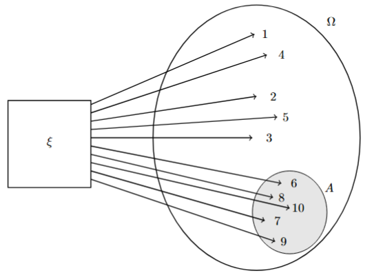

Quise empezar este cuaderno como proyecto personal para asentar mis conocimientos en la materia, sin embargo, he llegado a la conclusión de querer publicar estas notas para poder ayudar a estudiantes de la Facultad de Ciencias de la UNAM (o de otras universidades), por lo que estas notas siguen el temario oficial del curso de probabilidad I de la Facultad para la carrera de Actuaría (2015) y carreras afines.

# Espacios de Probabilidad.

## Espacio muestral, eventos y su intersección.

Empecemos motivando la conversación con la siguiente pregunta.

**¿Qué es un experimento aleatorio?**

Un *experimento aleatorio* es aquel que aunque se repita bajo las mismas condiciones el resultado no siempre es el mismo (e.g., un sismo, un partido de fútbol, el lanzamiento de un dado, etc.)

**Ejemplo:**

Analicemos el siguiente experimento aleatorio: observar las calificaciones de un grupo de clase.

$\Omega$ = {0, 1, 2, 3, 4, 5, 6, 7, 8, 9, 10}

y fijémonos en las calificaciones aprobatorias

$A$ = {6, 7, 8, 9, 10}

y en "bajas calificaciones" pero aprobatorias $(6 \leq x < 8)$

$B$ = {6, 7}

Notemos que:

$$A \subset \Omega, \; \; B\subset \Omega$$

y

$$A \cap B = \{6, 7\}$$

Y lo podemos visualizar en un diagrama:

{#fig-expale fig-align="center" width="70%"}

En la teoría de la probabilidad, se estudian estos eventos aleatorios con la finalidad de poder cuantificar dichos resultados y así poder decir si uno será *más probable que otro*.

Por su contraparte, un *experimento determinista* es aquel que mientras se repita bajo las mismas condiciones, tiene resultados previsibles (e.g., lanzar una piedra, sacar una bola roja de una urna que sólo contiene bolas rojas, etc.).

Con esto, podemos dar las siguiente definiciones:

**Definición:** Sea $\Omega$ el conjunto de todos los posibles resultados de un experimento aleatorio, a este conjunto se le llama *espacio muestral* o *espacio muestra*, y matemáticamente se le considera entonces como conjuntos arbitrario.

**Definición:** Una $\sigma-álgebra \; \mathscr{F} \;$ es una clase o colección no vacía de subconjuntos de $\Omega$, a los elementos de una $\sigma-álgebra$ se les llama *eventos*.\
Se dice que $\mathscr{F}$ es una $\sigma-álgebra$ si cumple con las siguiente características:

i.  Contiene al conjunto total, es decir $\Omega \in \mathscr{F}$.
ii. Es cerrada bajo complementos, es decir que si $A \in \mathscr{F}, \; \text{entonces} \; A^c \in \mathscr{F}$.
iii. Es cerrada bajo uniones numerables, es decir que si $\{A_n\}_{n \in \mathbb{N}} \; \text{es una sucesión de conjuntos de} \mathscr{F}, \; \text{entonces} \; \bigcup\limits_{n \in \mathbb{N}} A_n \in \mathscr{F}$

**Proposición:** Sea $\mathscr{F}$ una $\sigma-álgebra$ de subconjuntos de $\Omega$. Entonces

i.  $\emptyset \in \mathscr{F}$
ii. Si $A_1, A_2, ... \in \mathscr{F}$ entonces $\bigcap\limits_{n=1}^{\infty} A_n \in \mathscr{F}$

**Demostración:**

i.  Como $\Omega \in \mathscr{F}$ y ésta es una colección cerrada bajo complementos, entonces $\Omega^c = \emptyset$ por lo que $\emptyset \in \mathscr F$

ii. Si $A_1, A_2,... \in \mathscr{F}$ entonces $A_1^c, A_2^c, ... \in \mathscr{F}$, y si tomamos complementos y por las leyes de De Morgan tenemos que $\bigcap\limits_{n=1}^{\infty} A_n \in \mathscr{F}$

$\blacksquare$

**Definición:** Sea $P$ una función definida sobre una $\sigma-álgebra \; \mathscr{F}$ y con valores en el intervalo \[0,1\], es una *medida de probabilidad* si:

i.  $P(A) \geq 0, \; \forall A \in \mathscr{F}$
ii. $P(\Omega) = 1$
iii. $\sigma-álgebra \;$ es aditiva, es decir, si dada una sucesión $\{A_n\}_{n \in \mathbb{N}} \in \mathscr{F}$ de eventos mutuamente excluyentes (o ajenos), es decir $A_i \cap A_j = \emptyset ,\; i \neq j$, se cumple que $P(\bigcup\limits_{n=1}^{\infty} A_{n}) = \sum_{n=1}^{\infty} P(A_{n})$.

Con $P$ se busca asignar un valor numérico a cada evento dentro de un espacio muestral.

Una vez definidos estos tres elementos, podemos definir formalmente la terna $(\Omega, \mathscr{F}, P)$ como *espacio muestral*

**Definición:** Un espacio de probabilidad es una terna $(\Omega, \mathscr{F}, P)$, en donde $\Omega$ es un conjunto arbitrario, $\mathscr F$ es una $\sigma-álgebra$ de conjutnos de $\Omega$, y $P$ es una medida de probabilidad definida sobre $\mathscr{F}$.

Con la terna lo que buscamos es poder asociar un experimento aleatorio a un espacio de probabilidad, uno donde se pueda *medir* adecuadamente, es por esto que la asiganción de la que hablamos no sea única, pero eso se verá más adelante.

**Definición:** Sea $\Omega$ una colección de objetos (espacio muestral) y $\mathscr{F}$ una $\sigma-álgebra$ de conjuntos de $\Omega$. Luego $(\Omega,\mathscr{F})$ se dice que es un *espacio medible* y los elementos de $\mathscr{F}$, *conjuntos medibles* o *eventos*.\

A los postulados de medida de la probabilidad (también conocida como *probabilidad axiomática*) se le conocen como los axiomas de *Kolmogorov.*

## Probabilidad clásica

Es un enfoque en el cual se calcula la probabilidad de un evento donde asumimos que todos los posibles resultados de un experimento aleatorio tienen la misma probabilidad de ocurrencia, es decir, son *equiprobables.* Con esto, se define la probabilidad clásica del evento $A \subset \Omega$ como $$P(A) = \frac{\#A}{\#\Omega}$$ entendiéndose $\#$ como la cardinalidad del conjunto en cuestión.

Para esto, forzosamente $\#\Omega < \infty$ (debe ser finito), por lo que para calcular la probabilidad del evento $A$ basta con contar el número de elementos que éste tiene (bajo el supuesto de ser equiprobable).\
Otra forma de pensarlo es $$\frac{\#\text{Casos favorables.}}{\#\text{Casos totales.}} $$ Veamos este siguiente ejemplo bastante común.

**Ejemplo:** Sea un dado justo, nos interesa saber cuál es la probabilidad del evento donde el resultado observado sea mayor que $4$. Definamos nuestro evento y el espacio muestral.

$$A = \{5,6\}, \quad \Omega = \{1,2,3,4,5,6\}$$ Por lo que la probabilidad de obtener un número mayor que 4 como resultado será $$P[A] = \frac{\#A}{\#\Omega} = \frac{\#\{5,6\}}{\#\{1,2,3,4,5,6\}} = \frac{2}{6}=\frac{1}{3} \approx 0.\overline{333}$$

Este enfoque fue planteado por el matemático *Pierre de Laplace* en 1812.

## Probabilidad frecuentista

Es un enfoque en el cual se calcula la probabilidad de un evento como el <u>límite de su frecuencia relativa</u> cuando un experimento se repite un número infinito de veces bajo las <u>mismas condiciones.</u>

Con esto, se define la proba frecuencial de $A$ en $n$ ensayos del experimento como el siguiente límite $$P[A] = \lim_{n \rightarrow \infty} \frac{n(A)}{n}$$ donde $n(\cdot)$ representa el numero de ocurrencias del evento en las $n$ realizaciones.

En la práctica es imposible repetir un experimento un número infinito de veces. Por ello, se estima la probabilidad mediante la frecuencia relativa obtenida tras un gran número de repeticiones del experimento. Como veremos más adelante, bajo ciertas condiciones esta aproximación está respaldada por un importante resultado matemático conocido como la Ley de los Grandes Números.\
Veamos el siguiente ejemplo

**Ejemplo:**

Supongamos que lanzamos una moneda $10$ veces, de las cuales $7$ nos salieron cara y $3$ nos salieron cruces, con lo que obtenemos una probabilidad frecuentista relativa de $0.7$ para cara".\
Sin embargo, la probabilidad frecuentista no solo se establece con estos pocos datos, veamos hacía donde converge con $10,000$ intentos, pero como mencione, es imposible hacerlo en la vida real, por lo que lo programaremos en $R$

```{r}
#| label: Regularidad estadistica
#Fijamos una semilla
set.seed(30)

#definimos el numero de ensayos
n_ensayos <- 10000 

#simulamos el lanzamiento de la moneda 10,000 veces
# digamos que 1:cara, 0:cruz
moneda <- sample(c(0,1), n_ensayos, replace = TRUE)

# Contamos cuántas caras salieron
sum_sim <- sum(moneda == 1)

#Probabilidad frecuentista de cara
freq_cara <- cumsum(moneda) / (1:n_ensayos)

# Veamos como es que se van acercado estas simulaciones 
# en distintos tamaños de muestra y los guardamos para graficarlos
simulaciones <- c(
  mean(moneda[1:10]), #primeros 10
  mean(moneda[1:100]), #primeros 100
  mean(moneda[1:1000]), #primeros 1000
  mean(moneda[1:10000]) #todos: 10000 ensayos
)

#Eje X (tamaño de muestra)
x <- c(10, 100, 1000, 10000)

#Graficamos
plot(freq_cara,
     type = "l",
     ylim = c(0,1),
     col = "orange",
     lwd = 2,
     xlab = "Lanzamiento",
     ylab = "Frecuencia relativa",
     main = "Regularidad Estadística")

abline(h = 0.5, lty = 2, col="blue")

```

Podemos ver que dentro los $10,000$ lanzamientos, después de ciertos intentos va tendiendo hacía $0.5$ que si sustituimos en la fórmula del límite podemos ver que obtenemos:

$$\begin{gathered}
\text{primeros} \; 10 \; \text{intentos} \rightarrow 0.6 \\
\text{primeros} \; 100 \; \text{intentos} \rightarrow 0.47 \\
\text{primeros} \; 1,000 \; \text{intentos} \rightarrow 0.516 \\
\text{primeros} \; 10,000 \; \text{intentos} \rightarrow 0.497
\end{gathered}$$

Si hacemos un acercamiento a los primeros 500 lanzamientos podemos ver cómo es que se comportan las frecuencias

```{r}
#| label: RE 500 lanzamientos
# Hacemos un acercamiento a los primeros 1000 resultados 
# para ver como se comporta
plot(freq_cara,
     type= "l",
     ylim = c(0,1),
     xlim = c(0,500),
     col = "orange",
     lwd = 2,
     xlab = "Lanzamiento",
     ylab = "Frecuencia relativa",
     main = "Regularidad Estadística primeros 500 lanzamientos")

abline(h = 0.5, lty = 2, col="blue")
```

Podemos ver que desde los 400 lanzamientos (aproximadamente) ya comienza a oscilar cerca del 0.5 y conforme aumenta el número de lanzamientos, la frecuencia relativa de obtener cara presenta una menor variabilidad y converge hacia la probabilidad teórica de 0.5, ilustrando la Ley de los Grandes Números y respaldando la interpretación frecuentista de la probabilidad.

::: callout-note
### Más adelante...

Conexión con la **Ley de los Grandes Números**

La simulación anterior muestra que, conforme aumenta el número de lanzamientos, la frecuencia relativa de obtener cara parece estabilizarse alrededor de $0.5$.

Este comportamiento no es una simple observación experimental. Más adelante demostraremos que, bajo ciertas condiciones, la frecuencia relativa converge a la probabilidad verdadera del evento cuando el número de ensayos tiende a infinito. Este resultado recibe el nombre de Ley de los Grandes Números y constituye uno de los pilares de la teoría de la probabilidad.
:::

## Probabilidad geométrica

## Propiedades elementales de la probabilidad

Una vez definida la probabilidad mediante los axiomas de Kolmogórov y revisadas dos de sus principales interpretaciones (clásica y frecuentista), estamos en condiciones de estudiar algunas propiedades fundamentales que se deducen directamente de dichos axiomas. Estas propiedades serán utilizadas de forma recurrente a lo largo del curso y simplificarán el cálculo de probabilidades en numerosos problemas.

**Proposición:** Sea $(\Omega, \mathscr{F},P)$ un espacio de probabilidad. Entonces

i.  $P(\emptyset) = 0.$\
ii. Si $A_1,A_2,...,A_n \in \mathscr{F}$ son ajenos dos a dos, entonces
    $$P\left(\bigcup_{k=1}^n A_k\right)
    =
    \sum_{k=1}^n P(A_k).$$
iii.  $P(A^c) = 1 - P(A).$
iv.  Si $A \subseteq B,$ entonces $P(B-A) = P(B) - P(A).$
v.  Si $A \subseteq B,$ entonces $P(A) \leq P(B).$
vi.  $0 \leq P(A) \leq 1.$
vii. $P(A \cup B) = P(A)+P(B)-P(A \cap B).$
viii.  $P(A \cup B) \leq P(A) + P(B)$